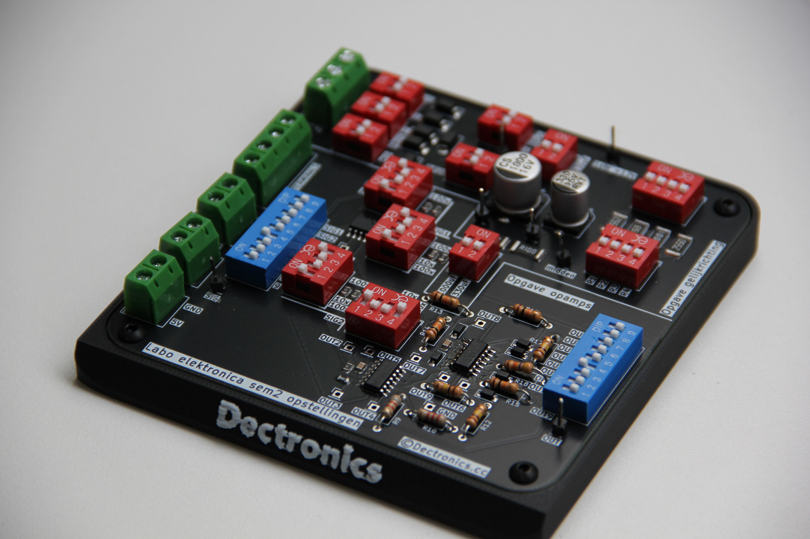
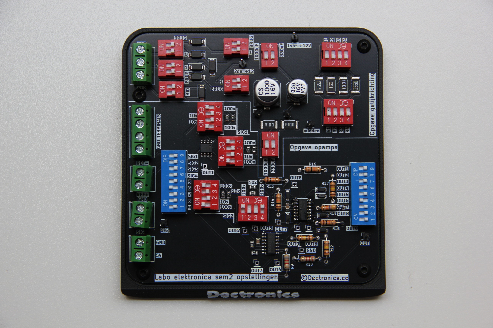

# Elektronica2-Labo-Opstelling

Complete printplaat met alle schakelingen van zowel gelijkrichting als opamps @Vives kortrijk
Met een printbare voet voor betere stabiliteit en geen kortsluiting te krijgen.

Het schema is als volgt:

Voor het solderen kan je gebruikmaken van de meegeleverde BOM file, alle componenten zijn 0805 buiten sommige TH componenten (omdat deze eigen keuze zijn en makkelijk te verangen moeten zijn)

